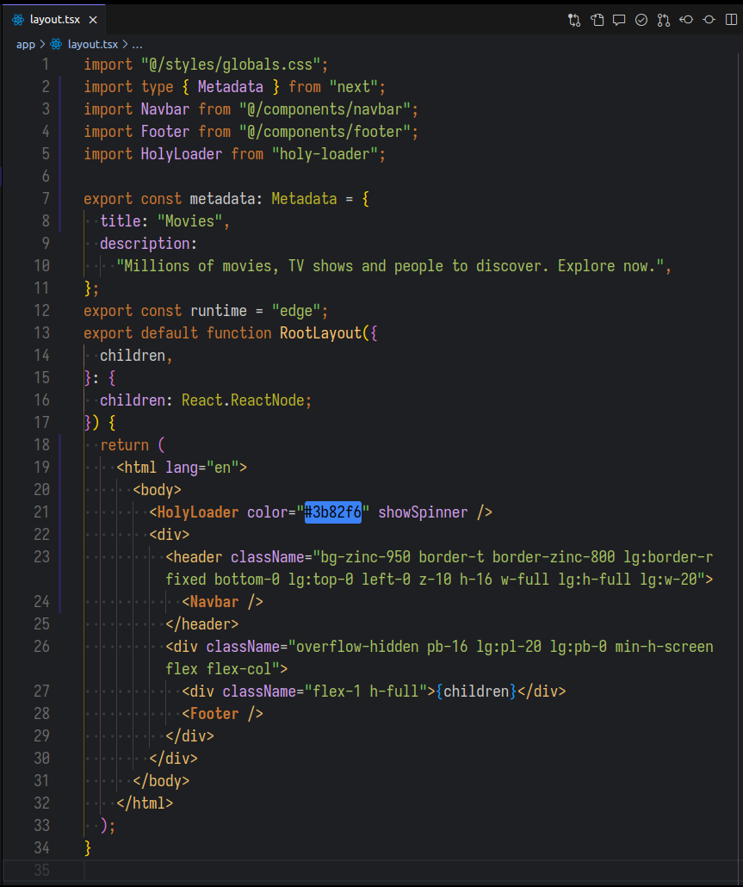
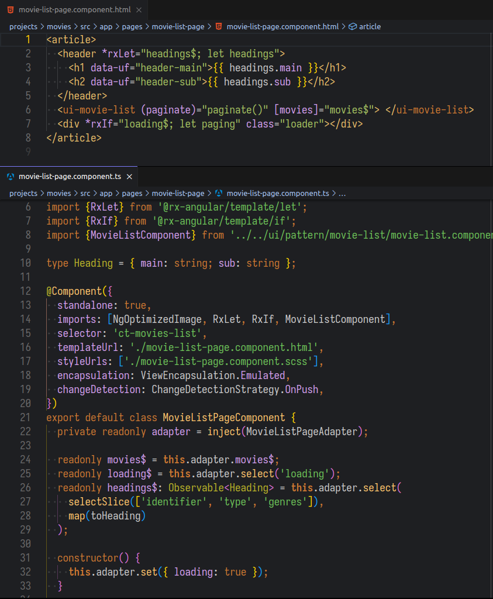
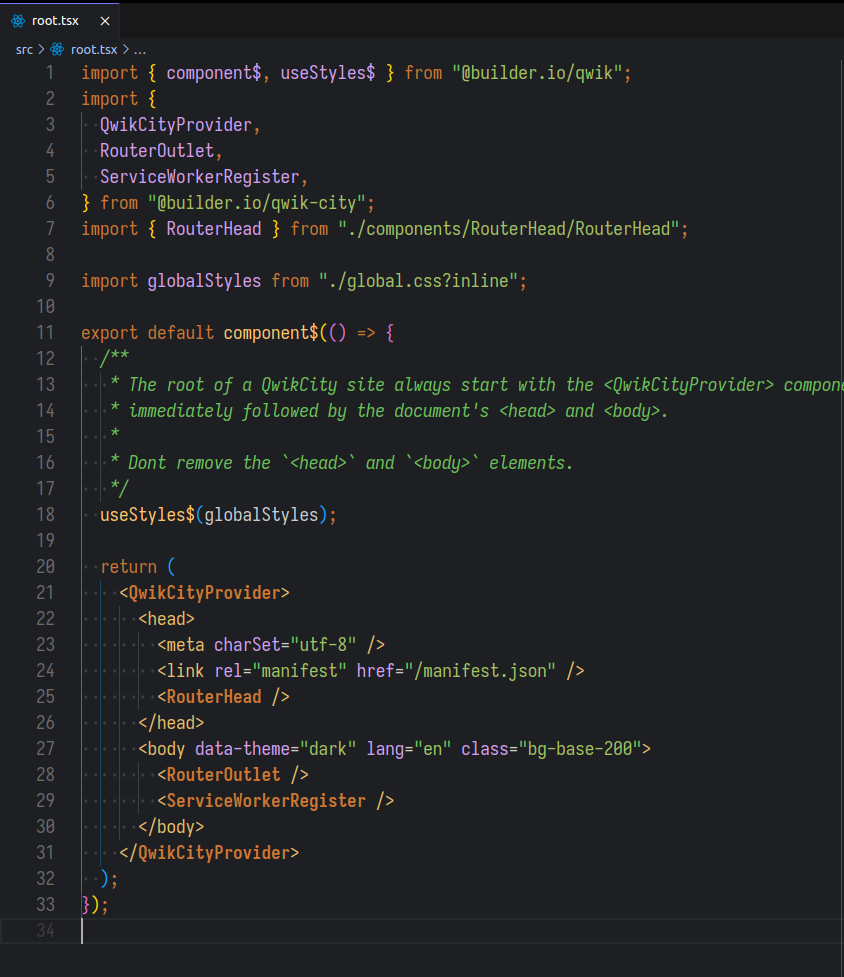
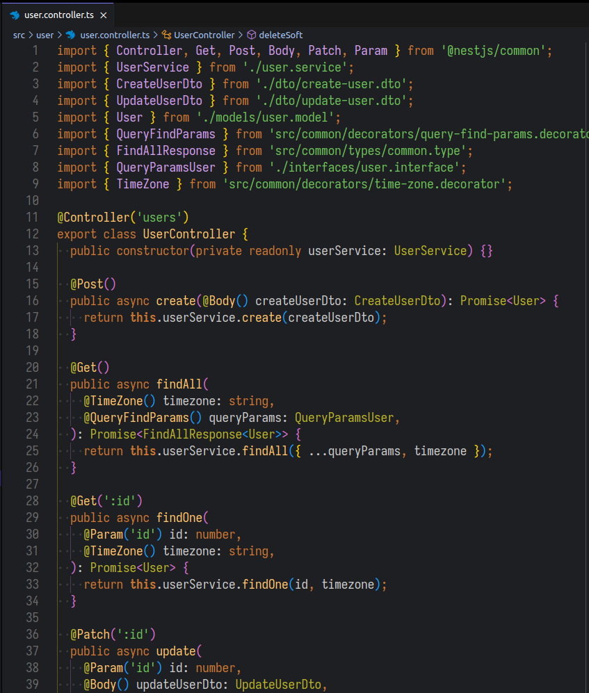

# Daynight Darcula theme for VS Code

A theme extension for [Visual Studio Code](https://code.visualstudio.com) based on **Darcula** theme from [Jetbrains](https://www.jetbrains.com) IDEs.

The Theme extension is available in [Visual Studio Marketplace](https://marketplace.visualstudio.com/items?itemName=igolskyi.vscode-day-night-theme) and [Open VSX Registry](https://open-vsx.org/extension/igolskyi/vscode-day-night-theme)

---

## Description

- Mainly focused on JS/TS development

- Note this theme **is not the same as the theme from JetBrains IDE**. There are a few modifications to match the look and feel of VS Code

## Screenshots

### React, Next.js

### Angular

### Qwik.js

### Nest.js

## Customizing

- If you want to customize on top of this theme, use vscode's [color customization](https://code.visualstudio.com/docs/getstarted/themes#_customizing-a-color-theme) feature

## Changelog

See [CHANGELOG.md]()

**Enjoy!**
